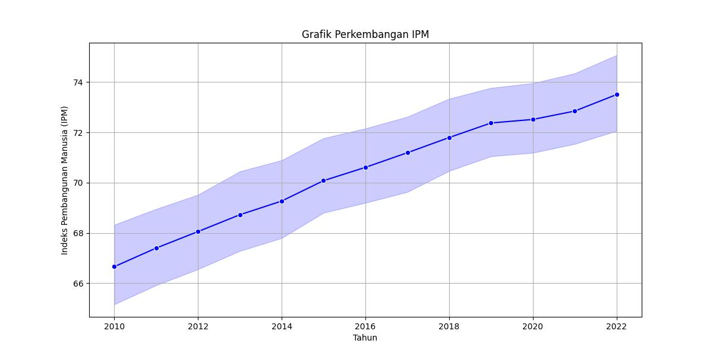

  
# Analisis Time Series untuk Memprediksi Indeks Pembangunan Manusia (IPM) Tahun 2023 Berdasarkan Data Historis Tahun 2010-2022(Studi Kasus: Kabupaten/Kota di Provinsi Jawa Tengah)

Indeks Pembangunan Manusia (IPM) adalah perbandingan dari harapan hidup, pendidikan, serta standar hidup bagi semua negara. IPM digunakan sebagai indikator untuk memperhitungkan aspek mutu dari pembangunan serta untuk mengelompokkan suatu negara sebagai negara maju, negara berkembang, atau negara terbelakang. IPM juga
digunakan untuk mengukur pengaruh kebijakan ekonomi terhadap mutu hidup. 

Dalam konteks ini, perlu dilakukan perencanaan untuk mempersiapkan hal-hal yang berkaitan dengan IPM. Salah satu langkah yang diambil adalah melakukan analisis peramalan Kabupaten/Kota di Provinsi Jawa Tengah berdasarkan komponen-komponen IPM. Hal ini bertujuan untuk melihat Kabupaten/Kota di Provinsi Jawa Tengah yangmemiliki IPM rendah, sedang, tinggi, dan sangat tinggi untuk tahun 2023. Sumber data yang digunakan dalam analisis ini adalah Website BPS Jawa Tengah.

Dengan tujuan untuk meningkatkan IPM pada Kabupaten/Kota di Provinsi Jawa Tengah, kami melakukan prediksi nilai IPM berdasarkan komponen-komponen IPM pada Kabupaten/Kota di Provinsi Jawa Tengah untuk tahun 2023. Komponen IPM yang dianalisis meliputi Usia Harapan Hidup (UHH), Harapan Lama Sekolah (HLS), Rata-rata Lama Sekolah, dan Pengeluaran Per Kapita. Usia Harapan Hidup menggambarkan jumlah tahun yang diharapkan dapat dicapai oleh bayi yang baru lahir untuk mampu bertahan hidup. Harapan Lama Sekolah adalah lamanya sekolah (dalam tahun) yang diharapkan akan dirasakan oleh anak pada umur tertentu di masa mendatang. Rata-rata Lama Sekolah mengacu pada jumlah tahun yang telah
diselesaikan oleh penduduk pada seluruh jenjang pendidikan formal yang pernah dijalani.

Sementara itu, Pengeluaran Per Kapita mencerminkan tingkat daya beli masyarakat dan melihat progres pembangunan manusia di suatu wilayah.Dengan menggabungkan analisis komponen komponen IPM dan melaksanakan peramalan, kami berharap dapat memberikan wawasan yang berharga untuk perencanaan dan upaya meningkatkan IPM pada Kabupaten/Kota di Provinsi Jawa Tengah.

