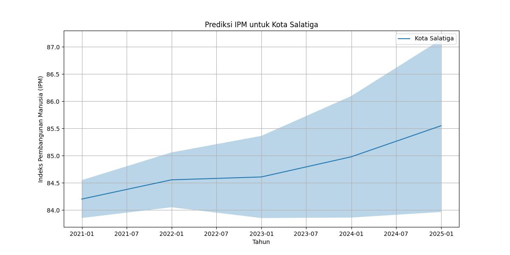

# Analisis Time Series untuk Memprediksi Indeks Pembangunan Manusia (IPM) Tahun 2023 Berdasarkan Data Historis Tahun 2010-2022(Studi Kasus: Kabupaten/Kota di Provinsi Jawa Tengah)

## Business Understanding
Indeks Pembangunan Manusia (IPM) adalah perbandingan dari harapan hidup, pendidikan, serta standar hidup bagi semua negara. IPM digunakan sebagai indikator untuk memperhitungkan aspek mutu dari pembangunan serta untuk mengelompokkan suatu negara sebagai negara maju, negara berkembang, atau negara terbelakang. IPM juga
digunakan untuk mengukur pengaruh kebijakan ekonomi terhadap mutu hidup. 

Dalam konteks ini, perlu dilakukan perencanaan untuk mempersiapkan hal-hal yang berkaitan dengan IPM. Salah satu langkah yang diambil adalah melakukan analisis peramalan Kabupaten/Kota di Provinsi Jawa Tengah berdasarkan komponen-komponen IPM. Hal ini bertujuan untuk melihat Kabupaten/Kota di Provinsi Jawa Tengah yangmemiliki IPM rendah, sedang, tinggi, dan sangat tinggi untuk tahun 2023. Sumber data yang digunakan dalam analisis ini adalah Website BPS Jawa Tengah.

Dari gambar di atas dapat diketahui bahwa Rata-rata lama sekolah paling berpengaruh dalam perkembangan Indeks Pembangunan Manusia di Jawa Tengah. Dengan melalui peramlan ini diharapkan dapat mengetahui Indeks Pembangunan manuisa di tahun 2023.

Dengan tujuan untuk meningkatkan IPM pada Kabupaten/Kota di Provinsi Jawa Tengah, kami melakukan prediksi nilai IPM berdasarkan komponen-komponen IPM pada Kabupaten/Kota di Provinsi Jawa Tengah untuk tahun 2023. Komponen IPM yang dianalisis meliputi Usia Harapan Hidup (UHH), Harapan Lama Sekolah (HLS), Rata-rata Lama Sekolah, dan Pengeluaran Per Kapita. Usia Harapan Hidup menggambarkan jumlah tahun yang diharapkan dapat dicapai oleh bayi yang baru lahir untuk mampu bertahan hidup. Harapan Lama Sekolah adalah lamanya sekolah (dalam tahun) yang diharapkan akan dirasakan oleh anak pada umur tertentu di masa mendatang. Rata-rata Lama Sekolah mengacu pada jumlah tahun yang telah
diselesaikan oleh penduduk pada seluruh jenjang pendidikan formal yang pernah dijalani.

Sementara itu, Pengeluaran Per Kapita mencerminkan tingkat daya beli masyarakat dan melihat progres pembangunan manusia di suatu wilayah.Dengan menggabungkan analisis komponen komponen IPM dan melaksanakan peramalan, kami berharap dapat memberikan wawasan yang berharga untuk perencanaan dan upaya meningkatkan IPM pada Kabupaten/Kota di Provinsi Jawa Tengah.

Hasil Analisis berguna untuk feature selection Dependen variabel : IPM Ada hubungan positif menguatkan antara UHH, HLS, RLS, PPK dengan IPM Semakin tinggi angka UHH, HLS, RLS, PPK maka nilai IPM juga semakin tinggi. Artinya semakin tinggi harapan bertahan hidup, semakin tinggi harapan lama sekolah oleh anak pada umur tertentu dimasa mendatang pada suatu daerah menunjukkan semakin tinggi pula nilai IPM pada daerah tersebut. Kemudian semakin tinggi rata rata jumlah tahun yang telah diselesaikan oleh penduduk pada jenjang pendidikan formal dan tingginya tingkat daya beli masyarakat pada suatu daerah juga menunjukkan semakin tingginya nilai IPM di daerah tersebut.

## Prediksi dan Business Value

Dalam upaya peningkatan IPM di Jawa Tengah, pemerintah dapat melihat potensi kabupaten/kota agar nilai IPM meningkat. Berdasarkan analisis penulis, Kota Salatiga  merupakan kota dengan nilai IPM tertinggi. Dengan ini dapat terus ditingkatkan nilai PPK-nya, karena Kota Salatiga merupakan De Schoonste Stad van Midderi-Java atau kota terindah di Jawa Tengah yang belum banyak diketahui. Sehingga sosialisasi mengenai pariwisata di Kota Salatiga dapat digencarkan untuk membantu peningkatan nilai IPM pada umumnya dan nilai PPK pada khususnya. 

Kota Semarang merupakan Kota dengan nilai IPM tertinggi kedua. Setelah dilakukan analisis, didapatkan hasil bahwa Kota Semarang memiliki nilai UHH yang tinggi dibandingkan dengan kabupaten/kota lainnya di Jawa Tengah. Hal ini bisa dicapai berkat komitmen dari pemerintah Kota Semarang untuk mewujudkan bagaimana masyarakat diberi fasilitas kesehatan. Dari hal tersebut, pemerintah provinsi dapat memberikan pandangan kepada kabupaten/kota lainnya untuk bersama-sama meningkatkan UHH dengan komitmen memberikan fasilitas kesehatan terbaik agar IPM dapat meningkat secara merata.

Solusi dari masalah ketimpangan nilai IPM di Jawa Tengah yaitu untuk semua kabupaten/kota yang memiliki nilai HLS dan RLS yang rendah, diperlukan penuntasan anak tidak sekolah. Dapat dilakukan pendataan terlebih dahulu serta mencari tahu alasan putus sekolah. Pemerintah dapat mencari solusi terbaik untuk menangani masalah tersebut (dapat diberikan beasiswa, sosialisasi pentingnya pendidikan, atau diberi keterampilan bekerja bagi penduduk usia angkatan kerja). Rendahnya nilai RLS dan HLS dapat disebabkan juga karena kurangnya ketersediaan sekolah dan fasilitas pendidikan yang belum memadai sehingga perlunya perhatian dari pemerintah setempat terkait hal tersebut.
